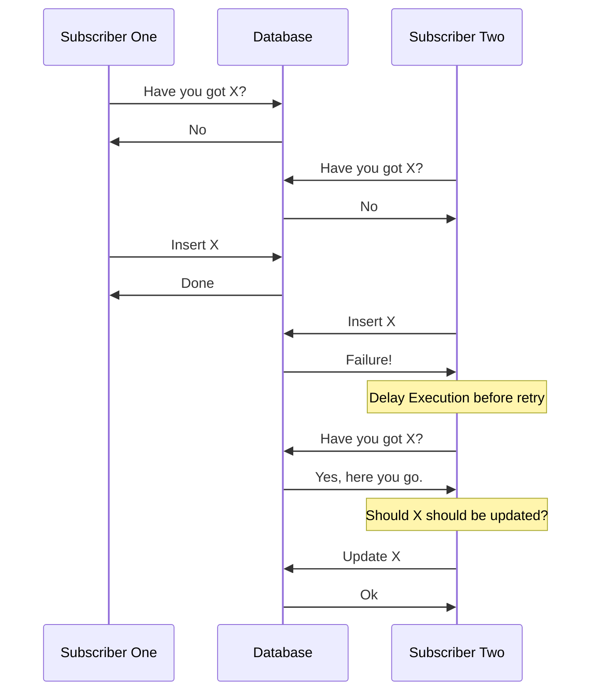

 

# KafkaConsumerRetry for .Net
A framework based on the UBER style of retry architecture
 - .Net Kafka Retry framework
 - Uses [Confluent's Kafka for .Net](https://github.com/confluentinc/confluent-kafka-dotnet)
 - Supports Apache Kafka, Confluent Cloud, Event Hub and any other service that has a standard Kafka API
 
The original Uber article text is in the local [ARTICLE.md](./ARTICLE.md) or
on [Uber](https://eng.uber.com/reliable-reprocessing/)

## Features:
- Multi cluster; retries can be on a different Kafka cluster. i.e. one that is in your control
- Timeouts and Retries are configurable
- Retry topic names are configurable
- Restrict number of "messages at a time"
- Partition "pausing" using the `librdkafka` API
- Gracefully handles allocation/loss of a consumer's partitions

## How do I use it?

Check out the [ExampleProject](./ExampleProject/) in the root directory for an example configuration. There is also the [TestConsole](./TestConsole/) which creates the topics, and pushes hundreds of messages to test the library.

The relevant topics will need to be created before the retry will work.
The test console project creates the topics using the Kafka Admin provided by Confluent's Kafka Library.

Using the default naming convention class `TopicNaming`:
- Retries are `{topic}.retry.{index}` with an start index of 0 (zero)
- DLQ's are `{topic}.dlq`

If you are wanting to use a different naming strategy, that can be done by implementing the `ITopicNaming` interface.

3 retry topics + a DLQ seems to be a good compromise of retry attempts, as the first one is used fairly often for DB insert collisions. The last 2 are for stickier errors usually related to network outages or service issues. 

## Does it support deserialisation?
Yes. Take a look at the example project's handler.  

## Why use a retry?
Sometimes things don't work the first time, and that's ok.
A good example is when two events at the same time tell a processor to either update or create an entity in a database.

Embracing the retry means not being too concerned about timing issues 

## The Happy/Sad Path of a failing message

### Notes
- Embrace the retry and don't be too concerned if messages end up in the first retry topic.
- If messages end up in the second or later topics then there might be an issue that needs looking at.
- DLQ is the end of the line, so make sure it's monitored!
- Retry times and retry delay are configurable per *consumer*
- Messages are queued for processing per partition, therefore keeping ordering where needed. 
- Delayed retries do not block other messages from being processed as they are handled per partition and are outside of the rate limiter
- In the case of retries, the messages on the same partition will have been added after the current message and so will need to wait *at least* the time the current message is waiting.
- The limit of parallel processing is restricted by the configurable `IRateLimiter`
- Exception information is carried along with the message that has failed. This can be viewed in the headers.
- Message exception failures are retried per *consumer group*; the consumer group information is stored in the headers of the pushed messages.
- If there are multiple consumer groups using the same retry topics, and more than one of those consumer groups fails, multiple copies of the message that failed will appear in the retry queue. This is normal and not a bug. 

### Main considerations that have been avoided by this library

#### Retry spamming

Retry spamming happens when a message is placed back into a queue when the time between attempts has not been reached.
This is a bad idea generally as it can flood messages, while also reducing visibility.

#### Worker starvation due to retry waits
In most implementations the consume is called and a message is returned.
This is then processed, and the cycle happens again.

With retries, often the thread is delayed until the message's retry time is up at which point the message is processed.
This has a few of problems.
- Not calling `Consume`  regularly will drop a consumer out of the consumer group. 
- While the processor is waiting to consume, processor time is wasted.

Sometimes this is mitigated by pushing the message back onto the retry queue, but this then becomes Retry Spamming.

#### Too many threads doing something at the same time
Sometimes it's not a good idea to do as much as possible. 
For example, when connecting to databases there is usually a limit to the number of connections that a process can have.

#### Avoiding main topic retries
Pushing messages to the main topic for retries is dirty. 
- Reduces visibility of system functions e.g. A dev asking "why is this message here multiple times?"
- You may not have the rights to push to the origin server topic
- Services that are not part of your retry system may be looking at that topic and process the message again

## Deep dive

### Topic Naming

Naming of the topic

| Class                   | Usage |
|-------------------------|-------|
| KafkaRetryConfig        |  Connection settings for the Origin and Retry Kafka Clusters. If no retry cluster is specified, then the origin will be used for the retry topics |
| TopicNames              | Responsible for the naming of the retries and dlq | 
| PartitionMessageManager | Controls the actions of the workers. More info below |

### PartitionMessageManager

`PartitionMessageManager` handles messages from the subscribed topics.
Internal message queues are updated on `Assigned`, `Revoked` and `Lost` partition events.

Incoming messages are added to a partition's work queue until a threshold is reached. When the threshold is reached,
the `Pause()` action is called on that topic's partition.

The `Pause()` call is not passed to the server, but is used by the internal Kafka
library [`librdkafka`](https://github.com/edenhill/librdkafka) to stop the requesting of messages from that topic's
partition.

`Resume()` is called when the work queue reaches zero. 

